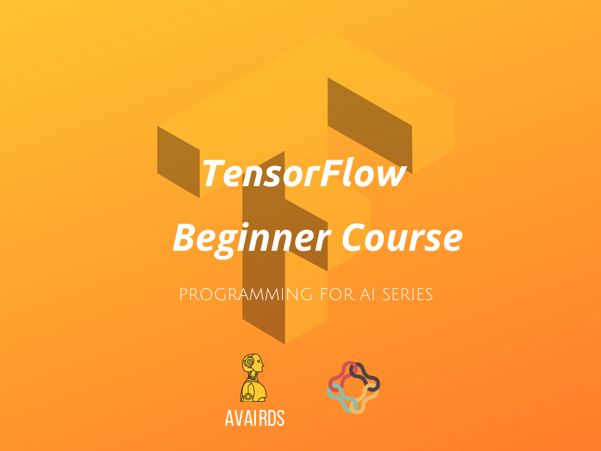

TensorFlow Beginner
==========================

TensorFlow ဆိုတာ Machine Learning, Deep Learning model တွေကို လွယ်ကူလျှင်မြန်စွာတည်​​​ဆောက်နိုင်ဖို့အတွက် Google Brain Team က ဖန်တီးထားတဲ့ Open Source Library တစ်ခုပါ။ နောက်ပြီး သူ့ကို ကိန်းကဏန်းကြီးမားတဲ့၊ အတွက်အချက်များပြားတဲ့ task တွေအတွက် ရည်ရွယ်ပြီး ဖန်တီးထားတာပါ။

ဘယ်​နေရာမှာသုံးမှာလဲ 🤔။

တကယ်တော့ TensorFlow ကို Mathematical Operations ​​​တွေမှာသာမကဘဲ သူ့ကို neural network အတွက် လိုအပ်တဲ့ dataset တွေတည်
ဆောက်တာ နောက်ပြီး Machine Learning project အတွက် ကိုယ်လိုချင်တဲ့ Prediction, Classification စတာတွေကို ဖန်တီးတည်ဆောက်ဖို့အတွက် TensorFlow ကို အသုံးပြုလို့ရပါတယ်😎။

ဒါဆိုရင် TensorFlow ကိုသုံးပြီး Machine Learning Project တွေကို လက်​တွေ့ဘယ်လို ဖန်တီးရမလဲ နောက်ပြီး သင်က Deep Learning နဲ့သက်ဆိုင်တဲ့ သီအိုရီတွေကို သိပြီးသားဆိုရင်တော့ လေ့လာလိုက်ကြရအောင် အဆင်သင့်ဖြစ်ပါပြီး။

Tensorflow Beginner သင်တန်းမှာသင်ယူရမယ့်​ခေါင်းစဥ်​တွေက​တော့

- Tensors and Operations
- Creating, Preprocessing Data
- Loading Datasets from various file formats
- Building and Training ANN models
- Saving and Loading Models
- Transfer Learning with Tensorflow Hub
- Quiz, Assignments and Mini-Project

စသဖြင့် ပါဝင်တာဖြစ်လို့ စိတ်၀င်စားတဲ့သူတွေအတွက် အကျိုးရှိစေမယ့် course ပါ။

လူငယ်တိုင်း ဆွဲခေါ်လာနိုင်ဖို့ ပထမဆုံး ခြေးလှမ်းအနေနဲ့ [**AVAIRDS**](https://www.facebook.com/avairds/) နဲ့  [**Alex Snow School**](https://www.alexsnowschool.org/) တို ပေါင်းစီပြီး Programing for AI  ဆိုတဲ့ Series တွေကို အခုလို့ စတင်  မိတ်ဆက်ပေးလိုက်တာ ဖြစ်ပါတယ်။

